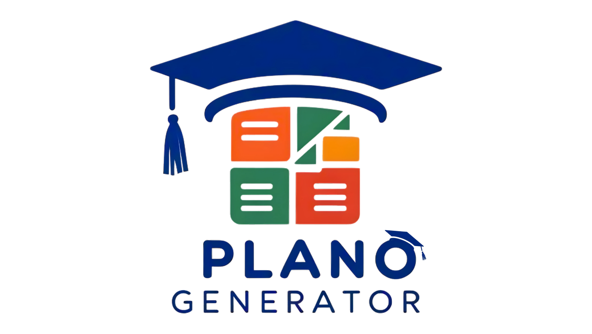

# 🎓 Plano Generator



**Plano Generator** é uma aplicação web projetada para automatizar a criação de Planos de Ensino Docente, seguindo a Metodologia SENAI. A solução integra uma interface de utilizador web, um backend inteligente que utiliza a IA Generativa do Google (Gemini 2.5 Pro) e a plataforma Google Workspace para transformar a documentação de uma Unidade Curricular (UC) numa planilha Google Sheets completa, formatada e pronta para uso em minutos.

---

## 📋 Tabela de Conteúdos

- [Sobre o Projeto](#sobre-o-projeto)
- [✨ Funcionalidades Principais](#-funcionalidades-principais)
- [🛠️ Tecnologias Utilizadas](#️-tecnologias-utilizadas)
- [🚀 Começando](#-começando)
  - [Pré-requisitos](#pré-requisitos)
  - [Configuração do Backend](#configuração-do-backend)
  - [Configuração do Google Apps Script](#configuração-do-google-apps-script)
- [💻 Como Usar](#-como-usar)
  - [Para Desenvolvimento Local](#para-desenvolvimento-local)
  - [Para Servidor de Produção (Ubuntu com PM2)](#para-servidor-de-produção-ubuntu-com-pm2)
- [📁 Estrutura do Projeto](#-estrutura-do-projeto)
- [👤 Criador](#-criador)

---

## Sobre o Projeto

O objetivo do **Plano Generator** é otimizar o tempo e o esforço de instrutores na elaboração de planejamentos docentes. A aplicação automatiza tarefas repetitivas e complexas, como a extração de conhecimentos, a associação com capacidades técnicas e o cálculo de cronogramas, garantindo consistência, qualidade e aderência à Metodologia SENAI.

---

## ✨ Funcionalidades Principais

- **Interface Web Intuitiva:** Um formulário simples para inserir todas as informações do curso e da Unidade Curricular.
- **Extração Inteligente de PDF:** A IA analisa o PDF do Plano de Curso e extrai a lista de Conhecimentos, respeitando a hierarquia de tópicos e subtópicos e focando apenas na Unidade Curricular correta.
- **Elaboração Pedagógica:** Para cada Conhecimento, a IA gera um plano detalhado, associando as Capacidades Técnicas corretas e sugerindo estratégias de ensino, instrumentos de avaliação e recursos variados.
- **Agendamento Flexível:** Um sistema de cálculo de datas híbrido que permite:
  - Selecionar datas de aula específicas e não sequenciais através de um calendário.
  - Definir um padrão de aulas recorrentes (ex: todas as segundas e quartas).
  - Considerar feriados e períodos de férias para um cronograma preciso.
- **Geração de Planilha Automatizada:** A aplicação comunica-se com um script do Google para criar uma planilha Google Sheets profissional, formatada e pronta para uso, com paginação automática para cursos longos.
- **Gestão de Segurança:** Gestão segura de chaves de API com `.env` e `.gitignore` para prevenir a exposição de credenciais sensíveis.

---

## 🛠️ Tecnologias Utilizadas

- **Frontend:** HTML5, CSS3, JavaScript
- **Backend:** Node.js, Express.js
- **Gestor de Processos:** PM2
- **IA Generativa:** Google Gemini 2.5 Pro Preview 06-05
- **Geração de Planilhas:** Google Apps Script
- **Dependências Principais:** `axios`, `cors`, `dotenv`, `multer`, `xlsx`, `@google/generative-ai`

---

## 🚀 Começando

Para executar este projeto, siga os passos abaixo.

### Pré-requisitos

- **Node.js:** Certifique-se de que tem uma versão LTS (Long Term Support) do Node.js instalada (ex: v18, v20 ou superior). Pode descarregá-lo em [nodejs.org](https://nodejs.org/).
- **PM2 (Para produção):** Se for implementar num servidor, o PM2 é necessário. Instale-o globalmente com `npm install pm2 -g`.

### Configuração do Backend

1.  **Clone ou Descarregue o Projeto:**
    Tenha todos os ficheiros do projeto na sua pasta principal (ex: `PlanoGenerator`).

2.  **Instale as Dependências:**
    Abra o terminal na pasta raiz do projeto (`PlanoGenerator`) e execute o seguinte comando:
    ```bash
    npm install
    ```

3.  **Crie o Ficheiro de Ambiente:**
    - Na pasta `assets/backend-planilhas`, crie um ficheiro chamado `.env`.
    - Dentro do `.env`, adicione a sua chave da API do Google Gemini:
      ```
      GEMINI_API_KEY=SUA_CHAVE_DE_API_AQUI
      ```

### Configuração do Google Apps Script

1.  **Crie um Novo Script:**
    - Vá a [script.google.com](https://script.google.com) e crie um novo projeto.
    - Cole o conteúdo do seu ficheiro Apps Script (as funções `doPost` e `criarCabecalho`) no editor.

2.  **Implante o Script:**
    - Clique em **Implantar > Nova implantação**.
    - Selecione o tipo **"App da Web"**.
    - Em **"Quem pode acessar"**, selecione **"Qualquer pessoa"**.
    - Clique em **Implantar** e autorize o acesso.
    - Copie a **URL do app da Web** gerada.

3.  **Atualize o `server.js`:**
    - No seu ficheiro `server.js`, cole a URL do app da Web na constante `APPS_SCRIPT_URL`.

---

## 💻 Como Usar

As instruções para iniciar o servidor dependem do seu ambiente.

### Para Desenvolvimento Local

Execute o servidor diretamente com o Node. No terminal, a partir da pasta raiz do projeto (`PlanoGenerator`), execute:

-   **No Windows:**
    ```bash
    node .\assets\backend-planilhas\server.js
    ```
-   **No Linux ou macOS:**
    ```bash
    node assets/backend-planilhas/server.js
    ```
A aplicação estará a ser executada, mas irá parar quando você fechar o terminal.

### Para Servidor de Produção (Ubuntu com PM2)

O PM2 irá manter a sua aplicação a ser executada 24/7 e a reiniciar automaticamente em caso de falhas ou após o reinício do servidor.

-   **Iniciar a Aplicação:**
    A partir da pasta raiz do projeto, execute:
    ```bash
    pm2 start assets/backend-planilhas/server.js --name "PlanoGenerator"
    ```

-   **Ver os Logs em Tempo Real:**
    ```bash
    pm2 logs PlanoGenerator
    ```

-   **Reiniciar a Aplicação (após atualizar o código):**
    ```bash
    pm2 restart PlanoGenerator
    ```

-   **Parar a Aplicação:**
    ```bash
    pm2 stop PlanoGenerator
    ```

---

## 📁 Estrutura do Projeto

```
PlanoGenerator/
├── assets/
│   ├── backend-planilhas/
│   │   ├── .env
│   │   └── server.js
│   ├── js/
│   │   ├── calendar-init.js
│   │   └── ui-interactions.js
│   ├── Images/
│   └── style.css
├── node_modules/
├── .gitignore
├── index.html
├── package-lock.json
├── package.json
└── README.md
```

---

## 👤 Criador

Este projeto foi idealizado e desenvolvido por **Samuel Teles dos Santos**.

- **LinkedIn:** [linkedin.com/in/samuel-teles-dos-santos-662003237](https://linkedin.com/in/samuel-teles-dos-santos-662003237)
